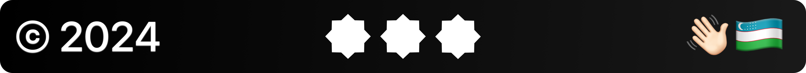

    

    <h3 align="center">DHP Implementation Guide for Uzbekistan</h3>

Welcome to the official repository of the **Digital Health Platform (DHP)** Implementation Guide of the Republic of Uzbekistan. This guide defines the interoperability standards, FHIR profiles, terminology bindings, and business processes that enable secure, patient-centric digital healthcare services nationwide.

> Published by **Uzinfocom** in collaboration with the **Ministry of Health of Uzbekistan** under the national healthcare digitalization program supported by **KfW Development Bank**.

## About the Project

The **DHP** is a unified digital infrastructure supporting Electronic Health Records (EHR), telemedicine, public health reporting, and integrated care across Uzbekistan.

- Project duration: 2024–2027
- Aligned with: _Digital Uzbekistan 2030_, _Presidential Decree PD-415_, _Concept for Health 2019–2025_
- Interoperability standard: **HL7® FHIR® R5**

## Guide Contents

This Implementation Guide includes:

- **FHIR profiles** for patient management, prescriptions, referrals, diagnostics, immunizations, etc.
- **Business use cases** (e.g., EHR exchange, appointment booking, public health reporting)
- **Security and access control models** (RBAC, consent, audit, OAuth2)
- **Terminology services**: ICD-11, SNOMED CT, LOINC, ATC, UCUM
- **Validation and examples** for all use cases

## Links

- **Live IG site**: [ig.medcore.uz](https://ig.medcore.uz)

## Contributors

| Name                                             | Role                          | Organization                                    |
| ------------------------------------------------ | ----------------------------- | ----------------------------------------------- |
| [@roosyabuddy](https://github.com/roosyabuddy)   | IG Maintainer                 | [Uzinfocom](https://uzinfocom.uz)               |
| [@vadi2](https://github.com/vadi2)               | Primary Author                | [Peretokin Consulting](https://vadimperetok.in) |
| Ministry of Health of the Republic of Uzbekistan | Strategic Partner             | Government                                      |
| KfW Development Bank                             | Financial & Technical Support | International Donor                             |

## License

This Implementation Guide is open-source under the **CC BY-SA 4.0** license - see the [LICENSE](license) file for details.

    

